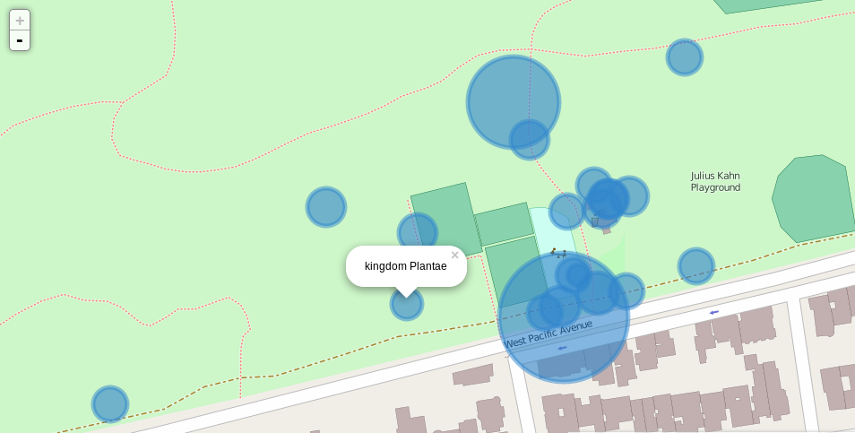

#[Fieldnotes](https://github.com/digitalvapor/fieldnotes)

How to embed your day of adventure and geotagging, then write a post in markdown, and use the code with an iPython notebook.

* See [redwood-regional]() for a post that uses just an iPython notebook (two iNat users).
* See [sutro-forest]() for a post that uses just a Pelican Plugin (two iNat users).
* See [muir]() for a post that uses both (single iNat user).
* See [jv-fitzgerald]() for another combo post (single iNat user). http://www.openstreetmap.org/way/37927739

##To-do
* Everything, **this is a work in progress**.

#Instructions
`git clone --recursive https://github.com/digitalvapor/fieldnotes.git`

For just the iPython Notebook portion, you can run `ipython notebook` in any folder that contains the notebooks.

For the whole website, that utilizes the static site generator Pelican, run `pelican && firefox output/index.html`.

##Dependencies
For generating the site.

* [Pelican](https://github.com/getpelican/pelican)
* This site uses the [burrito](https://github.com/fly/burrito) theme, use `--recursive` when cloning the repo to automatically include it.
* Add [assets](https://github.com/getpelican/pelican-plugins/tree/master/assets) (`pip install webassets cssmin`) and [pelican-ipynb](https://github.com/danielfrg/pelican-ipynb) plugins to your `pelicanconf.py` file. `PLUGINS = ['assets','pelican-ipynb']`

For the notebooks.

* `pip install ipython[notebook]`

For the maps.

* [Pandas](https://github.com/pydata/pandas)
* [Folium](https://github.com/wrobstory/folium)

##License
This work is licensed under a [Creative Commons Attribution-NonCommercial-ShareAlike 4.0 License](https://creativecommons.org/licenses/by-nc-sa/4.0/).
